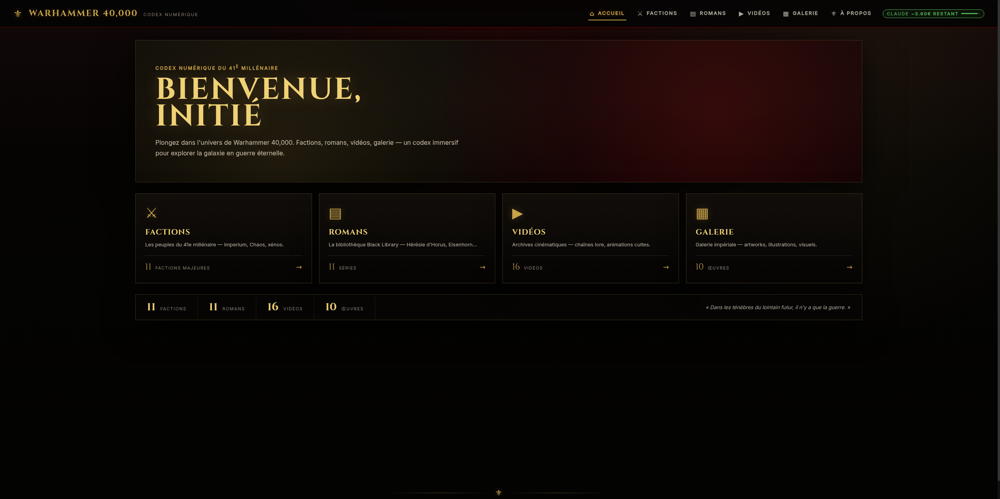

# Warhammer 40K Codex

> Codex personnel immersif lore-first sur l'univers de Warhammer 40000 : factions, sous-factions (chapitres SM, légions Chaos, régiments AM, etc.), unités, romans Black Library, vidéos lore, galerie d'art.



## Pourquoi

Dev Java/web depuis 2005, j'utilise ce projet pour explorer **Claude Code** sur un stack frontend que je ne pratique pas au quotidien : **Angular 19 + NestJS**.

Le sujet (W40K) est volontairement riche en lore + visuel pour pousser sur les enjeux UX : navigation hiérarchique, cards image-first, fil narratif central, intégration de sources externes (Wikipedia/Fandom, Reddit, 40k.gallery).

Mon rôle : direction artistique + cadrage du besoin.
Le rôle de Claude : poser le code, expliquer chaque choix, itérer.

En amont du code, [ChatGPT](https://chat.openai.com) a aidé à générer les premières maquettes UX et schémas de pages — point de départ visuel pour l'identité gothique noir/or.

## Fonctionnalités

- **9 pages** : Dashboard, Factions, Faction Detail, SubFaction Detail, Unit Detail, Romans, Vidéos, Galerie
- **Hiérarchie faction → sous-faction → unité** : 11 factions principales, 63 sous-factions (Ultramarines, Iron Hands, World Eaters, Krieg, etc.) avec successeurs, primarques, leaders actuels, notable units inline
- **Galerie 1500+ images** avec multi-catégorisation user (chips), import depuis Wikipedia Fandom / Reddit r/Warhammer40k / URL directe
- **Wiki-image proxy** (Wikipedia Fandom EN) pour fetch les illustrations à la volée
- **Black Library** — séries de romans avec progression de lecture
- **Vidéos lore** — chaînes YT (officielles + créateurs) catégorisées
- Cosmétique : design tokens custom (or sur fond noir, Cinzel/Inter), pas de Bootstrap/Material-default
- Stockage JSON, pas de DB

## Stack

| Couche | Tech |
|---|---|
| Frontend | Angular 19 standalone components + Material M3 + tokens CSS custom |
| Backend | NestJS 10 + TypeScript 5 + Anthropic SDK |
| Storage | JSON local (pas de DB) |
| Sources externes | Wikipedia Fandom EN (wiki-image proxy), Reddit JSON public, 40k.gallery |
| Build | Docker multi-stage (node:20-alpine → nginx:alpine) |
| Déploiement | docker-compose (testé Synology NAS DSM) |

## Setup local

### Prérequis
- Docker 24+
- Une [clé API Anthropic](https://console.anthropic.com/settings/keys)

### Lancement
```bash
git clone <ce-repo> warhammer40k
cd warhammer40k

cp backend/.env.example backend/.env
# Édite ANTHROPIC_API_KEY

# Bootstrap des données seed (premier lancement uniquement)
mkdir -p data/imported
cp backend/seed/*.json data/

docker compose up -d --build
```

Frontend disponible sur `http://localhost:4201`.

## Données seed

`backend/seed/` contient les fichiers JSON commités comme état initial :
- `factions.json` (11 factions principales)
- `subfactions.json` (63 sous-factions enrichies)
- `units.json` (catalogue d'unités)
- `artworks.json` + `artwork-collections.json` (catalog galerie + collections)
- `videos.json` + `channels.json` (lore-channels YT)
- `series.json` (romans Black Library)
- `lore-feed.json` (événements lore homepage)

Au premier lancement, copie ces fichiers dans `data/` (cf instructions ci-dessus). Ensuite `data/` n'est plus rejoué — tes catégorisations et imports persistent.

## Roadmap

Voir [WARHAMMER_ROADMAP.md](./WARHAMMER_ROADMAP.md) pour le plan d'enrichissement (Custodes, Drukhari, Grey Knights, Empereur, primarques, Chaos pantheon, lore concepts, galaxy map, civils impériaux).

## Notes légales

Warhammer 40000, ses factions, personnages et art sont la propriété de **Games Workshop**. Ce projet est un fan-codex personnel, non-commercial, à usage privé. Les images proxifiées proviennent de Wikipedia Fandom (CC BY-SA) et de sources publiques. Aucune redistribution.

## Crédits IA

- **[Claude Code](https://claude.com/claude-code)** (Anthropic) — code frontend, backend, infra Docker
- **[ChatGPT](https://chat.openai.com)** (OpenAI) — premières maquettes UX, schémas de pages, propositions visuelles

Sources lore : [Warhammer 40k Wiki](https://warhammer40k.fandom.com), [Lexicanum](https://wh40k.lexicanum.com), [2d4chan](https://2d4chan.org/wiki/Warhammer_40,000), [Black Library](https://www.blacklibrary.com/), PDF *WH40K Fluff Bible*.
UX : codex 2D-print + cards image-first à la Diablo III / Destiny grimoire.
Principes UX : [refactoringui.com](https://refactoringui.com/), [lawsofux.com](https://lawsofux.com/).

## Licence

MIT pour le code. Les contenus W40K appartiennent à Games Workshop.

---

**Si tu veux faire pareil** — prends un sujet qui t'enflamme, ouvre Claude Code, décris en langage naturel ce que tu rêves de voir exister, puis itère. Tu seras surpris de ce qu'on peut bâtir en quelques sessions.
